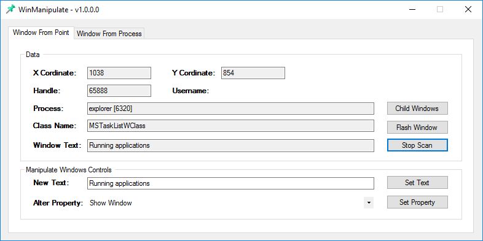
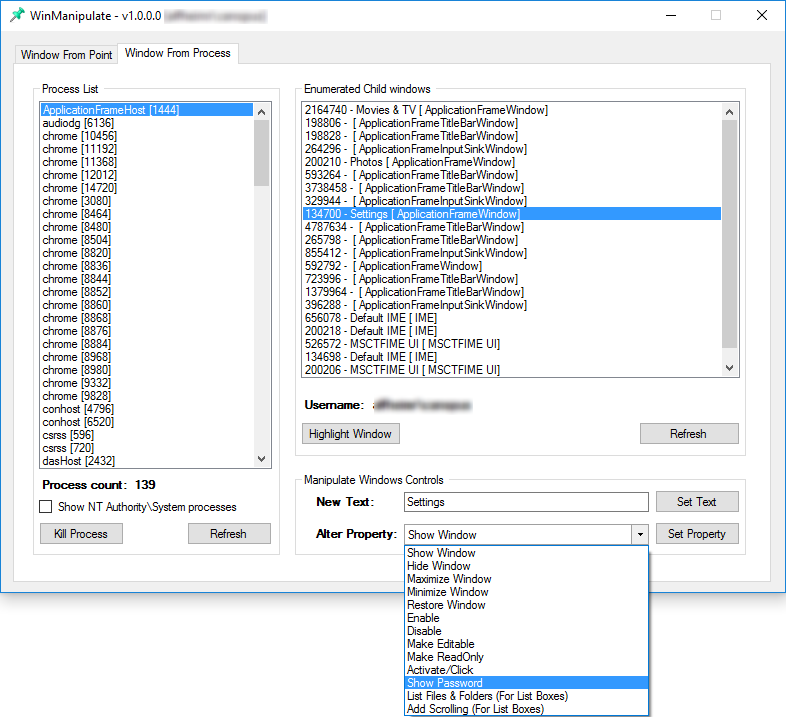

# WinManipulate

## What is it?
A simple utility to manipulate Windows window objects like buttons, menu bars, text boxes, OCX controls and others. Basically, anything that can be located as a Child Window and has an active window handle can be manipulated with some predefined attributes.

## Supported Operating Systems
This has been tested on Windows 7, 8.1 and Windows 10.
This may also work on Windows 2003/XP but that is untested territory.

Please note the executable binary made available in this repo is a x86 version.

## Requirements
- Microsoft Visual Studio 2013 for Desktop to compile
- Microsoft .NET Runtime 3.0 above present in the environment

## Compiling and Running
- Obtain a copy of [Visual Studio 2013 for Desktop](https://www.microsoft.com/en-in/download/details.aspx?id=44914) from the Microsoft website
- Any visual studio environment built later than 2013 will work, but the project will go through a one way upgrade.
- Open the WinManipulate.vbproj file to load the project.
- You can compile your own binaries by using the Build menu or use the binaries provided in the release.

## Usage
- Use Visual Studio's debug option or compile and run the program WinManipulate.exe. It is recommended to run this program as Administrator.

#### Window From Point
- The first tab allows (Window From Point) allows capturing window handles using the mouse cursor.
- Click on `Start Scan`. This will allow you to move your mouse cursor over visible window objects and obtain their owner process IDs and window handles.
- You can press the space bar or `Alt+S` to stop the scan so that the window handle is locked inside WinManipulate.
- The program window shows the process name and PID, the Class Name of 
- You can then use the `Alter Property` drop down to select any of the following attributes and set that property to the locked handle window.
    + Show Window
    + Hide Window
    + Maximize Window
    + Minimize Window
    + Restore Window
    + Enable
    + Disable
    + Make Editable
    + Make ReadOnly
    + Activate/Click
    + Show Password
    + List Files & Folders (For List Boxes)
    + Add Scrolling (For List Boxes)

#### Window From Process
- This tab allows you to interact with window objects based on running processes. 
- You can filter processes running as `NT Authority\System`. Very useful if you want to use this tool to discover privilege escalation bugs.
- You can enumerate child windows here and manipulate their attributes.
- Invisible windows are also listed here as long as the parent process is selected.
- If the program is not launched with Admin rights (UAC elevated), then the username field will contain `<access denied>` for processes created by higher privileged users and process list filter will not kick in. 

## Known bugs

1. The autoelevate option is not fully operational at this time. I'm working on a fix.
